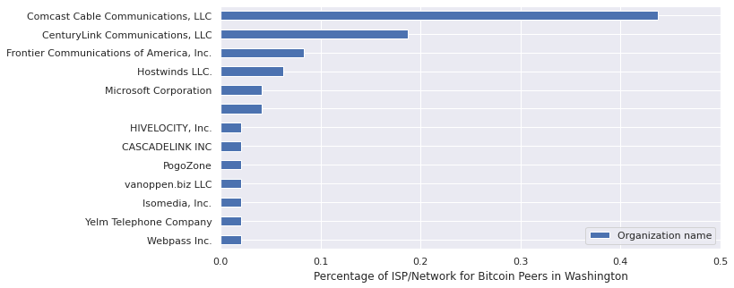

# Investigating Bitcoin Peer Data with bitnode.io and Ipython Notebooks

Author: John Naulty Jr.

### Info

[bitnode.io](https://bitnodes.io/) collects information on bitcoin peers and offers their API for free.

The creator has the source code for this project hosted on github at [ayeowch/bitnodes](https://github.com/ayeowch/bitnodes).

Before I started running this code, I wanted to play around with the API.

These are the preliminary results.


## Looking at the Data

### World Statistics

Most popular country is the US
Most popular network is Tor


```

           Country code Organization name
    count          9234              9234
    unique           96              1034
    top              US       Tor network
    freq           1854              1544
    
    Tor network                          0.167208
    Hetzner Online GmbH                  0.110461
    Amazon.com, Inc.                     0.076998
    DigitalOcean, LLC                    0.052415
    OVH SAS                              0.051115
    Comcast Cable Communications, LLC    0.021009
    Contabo GmbH                         0.019710
    Google LLC                           0.018302
    Alibaba (US) Technology Co., Ltd.    0.014620
    Charter Communications Inc           0.013537
    Name: Organization name, dtype: float64

```


#### Top ISP Provider / Network for World


#### Worldwide Distribution of Peers


### US Statistics 

#### US Distribution of Peers


#### US Distribution of Peers of Comcast Users


#### US ISP Distribution 


#### ISP Distribution by State

##### Comcast Distribution 


##### Amazon Distribution 


##### Charter ISP Distribution 


### State Distribution by ISP

##### California ISP Distribution 


##### Virginia ISP Distribution 


##### New Jersey ISP Distribution 


##### Texas ISP Distribution 


##### Kansas ISP Distribution 


##### Washington ISP Distribution 



### US State/ISP Comparison

```python
us_intersection["NAME"].value_counts(normalize=True).nlargest(10)
```


    California    0.199674
    Virginia      0.105550
    New Jersey    0.088139
    Kansas        0.080522
    Ohio          0.065832
    Oregon        0.057671
    Texas         0.054407
    New York      0.044614
    Washington    0.026115
    Florida       0.024483
    Name: NAME, dtype: float64


#### US State Distribution Graph


```python
us_intersection[["NAME", "Organization name"]].groupby('NAME').describe()
```


<div>
<style scoped>
    .dataframe tbody tr th:only-of-type {
        vertical-align: middle;
    }

    .dataframe tbody tr th {
        vertical-align: top;
    }

    .dataframe thead tr th {
        text-align: left;
    }

    .dataframe thead tr:last-of-type th {
        text-align: right;
    }
</style>
<table border="1" class="dataframe">
  <thead>
    <tr>
      <th></th>
      <th colspan="4" halign="left">Organization name</th>
    </tr>
    <tr>
      <th></th>
      <th>count</th>
      <th>unique</th>
      <th>top</th>
      <th>freq</th>
    </tr>
    <tr>
      <th>NAME</th>
      <th></th>
      <th></th>
      <th></th>
      <th></th>
    </tr>
  </thead>
  <tbody>
    <tr>
      <th>Alabama</th>
      <td>11</td>
      <td>5</td>
      <td>WideOpenWest Finance LLC</td>
      <td>4</td>
    </tr>
    <tr>
      <th>Arizona</th>
      <td>27</td>
      <td>12</td>
      <td>Cox Communications Inc.</td>
      <td>9</td>
    </tr>
    <tr>
      <th>Arkansas</th>
      <td>1</td>
      <td>1</td>
      <td>Comcast Cable Communications, LLC</td>
      <td>1</td>
    </tr>
    <tr>
      <th>California</th>
      <td>367</td>
      <td>43</td>
      <td>Google LLC</td>
      <td>71</td>
    </tr>
    <tr>
      <th>Colorado</th>
      <td>25</td>
      <td>7</td>
      <td>Comcast Cable Communications, LLC</td>
      <td>13</td>
    </tr>
    <tr>
      <th>Connecticut</th>
      <td>10</td>
      <td>5</td>
      <td>Cablevision Systems Corp.</td>
      <td>3</td>
    </tr>
    <tr>
      <th>District of Columbia</th>
      <td>5</td>
      <td>4</td>
      <td>MCI Communications Services, Inc. d/b/a Verizo...</td>
      <td>2</td>
    </tr>
    <tr>
      <th>Florida</th>
      <td>45</td>
      <td>14</td>
      <td>Charter Communications, Inc</td>
      <td>11</td>
    </tr>
    <tr>
      <th>Georgia</th>
      <td>32</td>
      <td>8</td>
      <td>AT&amp;T Services, Inc.</td>
      <td>13</td>
    </tr>
    <tr>
      <th>Idaho</th>
      <td>5</td>
      <td>3</td>
      <td>Cable One</td>
      <td>2</td>
    </tr>
    <tr>
      <th>Illinois</th>
      <td>30</td>
      <td>11</td>
      <td>Comcast Cable Communications, LLC</td>
      <td>15</td>
    </tr>
    <tr>
      <th>Indiana</th>
      <td>4</td>
      <td>3</td>
      <td>Comcast Cable Communications, LLC</td>
      <td>2</td>
    </tr>
    <tr>
      <th>Iowa</th>
      <td>6</td>
      <td>5</td>
      <td>Mediacom Communications Corp</td>
      <td>2</td>
    </tr>
    <tr>
      <th>Kansas</th>
      <td>148</td>
      <td>50</td>
      <td>Hurricane Electric LLC</td>
      <td>22</td>
    </tr>
    <tr>
      <th>Kentucky</th>
      <td>2</td>
      <td>2</td>
      <td>Charter Communications Inc</td>
      <td>1</td>
    </tr>
    <tr>
      <th>Louisiana</th>
      <td>1</td>
      <td>1</td>
      <td>AT&amp;T Services, Inc.</td>
      <td>1</td>
    </tr>
    <tr>
      <th>Maine</th>
      <td>5</td>
      <td>2</td>
      <td>Charter Communications Inc</td>
      <td>4</td>
    </tr>
    <tr>
      <th>Maryland</th>
      <td>31</td>
      <td>5</td>
      <td>MCI Communications Services, Inc. d/b/a Verizo...</td>
      <td>17</td>
    </tr>
    <tr>
      <th>Massachusetts</th>
      <td>37</td>
      <td>8</td>
      <td>Boston University</td>
      <td>13</td>
    </tr>
    <tr>
      <th>Michigan</th>
      <td>23</td>
      <td>6</td>
      <td>Comcast Cable Communications, LLC</td>
      <td>12</td>
    </tr>
    <tr>
      <th>Minnesota</th>
      <td>13</td>
      <td>7</td>
      <td>Comcast Cable Communications, LLC</td>
      <td>4</td>
    </tr>
    <tr>
      <th>Mississippi</th>
      <td>1</td>
      <td>1</td>
      <td>BCI Mississippi Broadband,LLC</td>
      <td>1</td>
    </tr>
    <tr>
      <th>Missouri</th>
      <td>35</td>
      <td>10</td>
      <td>Charter Communications</td>
      <td>8</td>
    </tr>
    <tr>
      <th>Montana</th>
      <td>2</td>
      <td>2</td>
      <td>Charter Communications</td>
      <td>1</td>
    </tr>
    <tr>
      <th>Nebraska</th>
      <td>2</td>
      <td>2</td>
      <td>Cox Communications Inc.</td>
      <td>1</td>
    </tr>
    <tr>
      <th>Nevada</th>
      <td>21</td>
      <td>10</td>
      <td>Cox Communications Inc.</td>
      <td>8</td>
    </tr>
    <tr>
      <th>New Hampshire</th>
      <td>10</td>
      <td>3</td>
      <td>Comcast Cable Communications, LLC</td>
      <td>8</td>
    </tr>
    <tr>
      <th>New Jersey</th>
      <td>162</td>
      <td>8</td>
      <td>DigitalOcean, LLC</td>
      <td>128</td>
    </tr>
    <tr>
      <th>New Mexico</th>
      <td>2</td>
      <td>2</td>
      <td>TULAROSA COMMUNICATIONS, INC.</td>
      <td>1</td>
    </tr>
    <tr>
      <th>New York</th>
      <td>82</td>
      <td>19</td>
      <td>Charter Communications Inc</td>
      <td>20</td>
    </tr>
    <tr>
      <th>North Carolina</th>
      <td>26</td>
      <td>5</td>
      <td>Charter Communications Inc</td>
      <td>11</td>
    </tr>
    <tr>
      <th>North Dakota</th>
      <td>1</td>
      <td>1</td>
      <td>Cable One</td>
      <td>1</td>
    </tr>
    <tr>
      <th>Ohio</th>
      <td>121</td>
      <td>8</td>
      <td>Amazon.com, Inc.</td>
      <td>96</td>
    </tr>
    <tr>
      <th>Oklahoma</th>
      <td>6</td>
      <td>3</td>
      <td>Cox Communications Inc.</td>
      <td>3</td>
    </tr>
    <tr>
      <th>Oregon</th>
      <td>106</td>
      <td>10</td>
      <td>Amazon.com, Inc.</td>
      <td>86</td>
    </tr>
    <tr>
      <th>Pennsylvania</th>
      <td>38</td>
      <td>12</td>
      <td>MCI Communications Services, Inc. d/b/a Verizo...</td>
      <td>15</td>
    </tr>
    <tr>
      <th>Rhode Island</th>
      <td>4</td>
      <td>2</td>
      <td>Cox Communications Inc.</td>
      <td>3</td>
    </tr>
    <tr>
      <th>South Carolina</th>
      <td>14</td>
      <td>9</td>
      <td>Charter Communications Inc</td>
      <td>3</td>
    </tr>
    <tr>
      <th>Tennessee</th>
      <td>7</td>
      <td>5</td>
      <td>Charter Communications</td>
      <td>2</td>
    </tr>
    <tr>
      <th>Texas</th>
      <td>100</td>
      <td>22</td>
      <td>Charter Communications Inc</td>
      <td>24</td>
    </tr>
    <tr>
      <th>Utah</th>
      <td>10</td>
      <td>4</td>
      <td>Unified Layer</td>
      <td>5</td>
    </tr>
    <tr>
      <th>Vermont</th>
      <td>3</td>
      <td>3</td>
      <td>Comcast Cable Communications, LLC</td>
      <td>1</td>
    </tr>
    <tr>
      <th>Virginia</th>
      <td>194</td>
      <td>12</td>
      <td>Amazon.com, Inc.</td>
      <td>104</td>
    </tr>
    <tr>
      <th>Washington</th>
      <td>48</td>
      <td>13</td>
      <td>Comcast Cable Communications, LLC</td>
      <td>21</td>
    </tr>
    <tr>
      <th>West Virginia</th>
      <td>1</td>
      <td>1</td>
      <td>Reliable Hosting Services</td>
      <td>1</td>
    </tr>
    <tr>
      <th>Wisconsin</th>
      <td>11</td>
      <td>5</td>
      <td>Charter Communications Inc</td>
      <td>6</td>
    </tr>
    <tr>
      <th>Wyoming</th>
      <td>3</td>
      <td>2</td>
      <td>Charter Communications</td>
      <td>2</td>
    </tr>
  </tbody>
</table>
</div>


